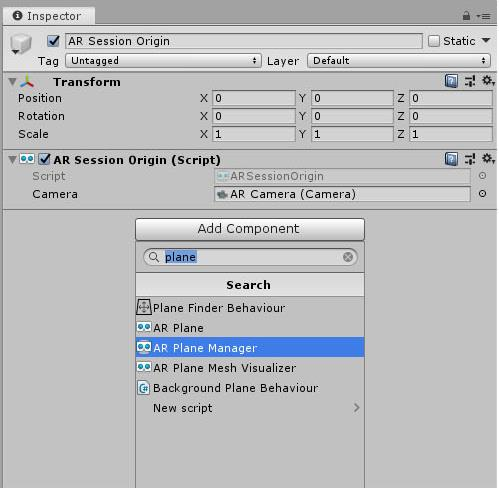
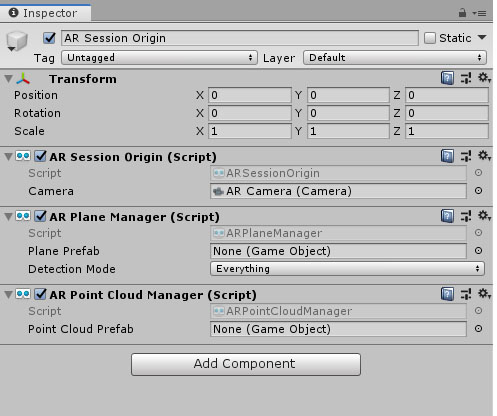
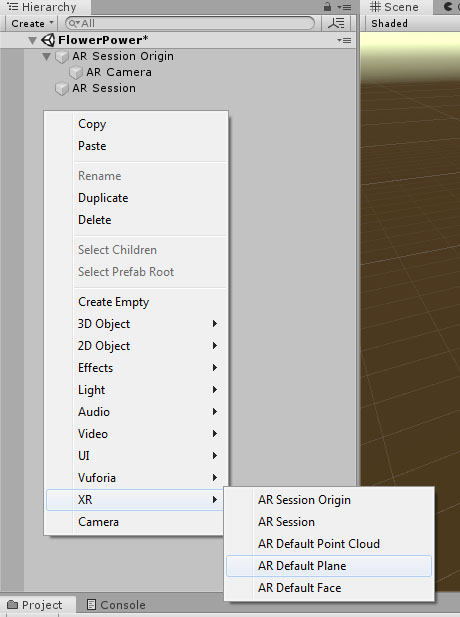
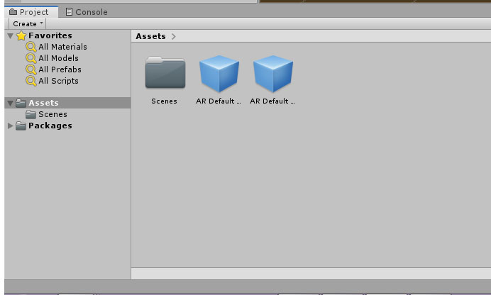
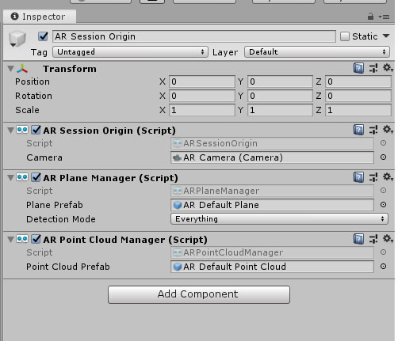
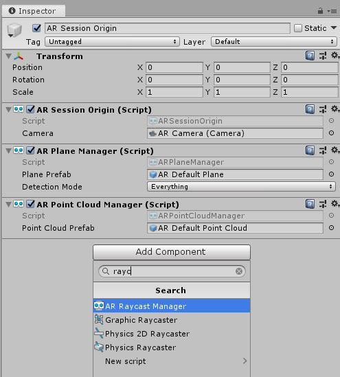

# AR Foundations Demo App

This is a tutorial and resources for getting started building AR apps with Unity's AR Foundation plugin. You can follow along with this tutorial in your own project, and make use of the art assets included in the plants.unitypackage, or you can jump in at any stage of the project by opening the included Unity project and choosing the scenes labeled 'Step1-Setup', etc. The final stage of the tutorial is represented in the FlowerPower scene.

This tutorial presumes a moderate level of familiarity with Unity.

----
## Resources
[AR Foundations Sample Apps by Unity](https://github.com/Unity-Technologies/arfoundation-samples)

These sample scenes are a good place to start to see how to create a AR Foundations scene.

[AR Foundations Documentation -- v2.2](https://docs.unity3d.com/Packages/com.unity.xr.arfoundation@2.2/manual/index.html)

From the Manual, this covers setup and describes the basic features of the package.

## Demo App
The concept for this app is that you can place some seedlings in your environment and then when you 'throw' water at them, they will grow. For the demo, we will cover how to place objects onto a detected plane and also how to spawn a water prefab to interact with these virtual items. However, you could develop the gameplay more in a number of ways -- by adding different varieties of plants with different requirements (how much water, i.e.), introducing different mechanics such as fertilizers or weeding, adding timers to the 'watering can' or the plants, etc. 

----
### Setup

1. Launch Unity and start a new 3D project.
2. In `Window > Package Manager`:
 - select `All Packages` from the dropdown at the top left of the Package Manager and wait for packages to load
 - Locate **ARFoundation** and hit `Install`
 - Install **ARKit XR Plugin**, **ARCore XR Plugin**, or both depending on your target hardware. Note you'll need a Mac + iOS device to build for iOS. You can build for Android from either a Mac or PC.
3. Close the Package Manager, and delete the Camera and Directional Light from the Hierarchy. You should have an empty Scene now.
4. Right-click in the Hierarchy, and select `XR > AR Session` from the context menu.
5. Right-click in the Hierarchy, select `XR > AR Session Origin` from the context menu.


*Your Hierarchy should appear like this after adding the AR Session and AR Session Origin prefabs*

---

### Build Your App to Your Device

You can now build your empty AR scene and you will see the camera output to the screen. Even if you want to skip the build step, it's a good time to get your Build Settings straightened out.

1. Go to `File > Build Settings`
2. Select either **Android** or **iOS** from the Platform list and hit `Switch Platform` -- you will have to wait for a few minutes for this process.
3. Still in Build Settings, add the current scene to the build by hitting the `Add Open Scenes` button at the bottom right of the Scenes in Build field.
4. Now click the `Player Settings...` button at the bottom left of the Build Settings window. You'll need to change several settings, depending on your platform (iOS or Android)
 
**iOS:**
   
- In `Player Settings > Other Settings > Identification` add an appropriate Bundle Identifier and your Apple Developer Signing information (most likely just your Apple ID).
- In `Player Settings > Other Settings > Configuration` enter `Camera` in the **Camera Usage Description** field.
- Check the `Requires ARKit Support`

**Android:**

 - In `Other Settings > Rendering > Graphics APIs` remove Vulkan from the list by selecting it and clicking the minus button.
 - In `Other Settings > Rendering` **Deselect** the **Multithreaded Rendering** checkbox 
 - In `Other Settings > Identification` add an appropriate Package Name
 - In `Other Settings > Identification` change the `Minimum API Level` to **Android 7.0 'Nougat' (API level 24)**
 - In `Other Settings > Configuration > Target Architectures` make sure **x86** support is **Disabled**

You'll also want to change your Company Name and Product Name at the top of the Player Settings window.

Now, you can try building your app if you'd like. Even though it looks like you're seeing just the device camera rendering directly to your phone's screen, ARFoundation is doing a lot behind the scenes. We'll see how to visualize this in the next section.

----

### Plane and Point Detection

Now we might want to be able to visualize the plane and point detection capabilities of AR Foundation. To do this, we will add some components to the ARSessionOrigin game object.

1. Select the ARSession Origin in the Hierarchy, and then in the Inspector, click `Add Component` and then search for ARPlaneManager. Click to add the component to the game object.



*Adding the ARPlaneManager script component to the ARSessionOrigin*

2. With the ARSessionOrigin still selected, click `Add Component` again in the Inspector. This time, search for ARPointCloudManager, and add it to the game object as before.

Your ARSessionOrigin object will now look like this:



*ARSessionOrigin with both ARPlaneManager and ARPointCloudManager script components*

You may have noticed there is also something called an ARReferencePointManager. Reference Points are added and managed manually by the developer, so even if we added an ARReferencePointManager to the SessionOrigin object, we wouldn't see anything unless we started adding points manually via script.

Now we have the Managers in place on the Session Origin, but we still won't see anything until we assign something to the `Plane Prefab` field of the ARPlaneManager script and the `Point Cloud Prefab` of the ARPointCloudManager. You can create your own custom objects for these prefabs, but we'll use the default assets provided as part of AR Foundation.

To create the prefabs, we first need to add the provided assets to our Hierarchy.

3. Right click inside the Hierarchy and select `XR > AR Default Plane` to place an AR Default Plane object in the Hierarchy.



*Add an AR Default Plane game object to the Hierarchy by right clicking and selecting it from the dropdown*

4. As above, right click inside the Hierarchy and select `XR > AR Default Point Cloud` to place an AR Default Point Cloud object in the Hierarchy.

Now, we need to make these two new objects into prefabs.

5. Drag the AR Default Plane and AR Default Point Cloud into the Assets folder (in the Project window), to transform them into prefabs. Once they are prefabs, you'll see that they appear as blue cubes in the Project window. The icons in the Hierarchy will have also changed to blue.



*Drag the plane and point game objects to the project window to make them into prefabs.*

6. Once the prefabs are saved in the Assets folder, delete the two prefabs from the Hierarchy.

7. Select the AR Session Origin object in the Hierarchy again. Drag the correct prefab from the Assets folder (Project Window) into the `Plane Prefab` field of the AR Plane Manager and the `Point Cloud Prefab` field of the AR Point Cloud Manager.



*The ARSessionOrigin with the plane prefab and the point cloud prefab correctly assigned for plane and point detection/visualization.*


Now if you build your project to your device, you should see a mesh of triangles depicting detected planes, as well as a bunch of points representing the point cloud.

---

### Placing objects in our AR environment

Now that we can detect planes, let's place a virtual object on the plane. I've included some starter assets in keeping with the gardening theme of the app, if you'd like to use them.

1. Import the `plants.unitypackage` included in this repo by selecting `Assets > Import Package > Custom Package...` and navigating to the plants.unitypackage.

There are two ways to capture ray hits on a detected plane or point surface: 
```
public bool Raycast(Vector2 screenPoint, List<ARRaycastHit> hitResults, TrackableType trackableTypeMask = TrackableType.All);

public bool Raycast(Ray ray, List<ARRaycastHit> hitResults, TrackableType trackableTypeMask = TrackableType.All, float pointCloudRaycastAngleInDegrees = 5f);
```
We're going to use the first, simpler version which is fine for casting rays from touch events on the screen.

2. Add an `ARRaycastManager` script component to the ARSessionOrigin.



*We need the raycast manager to be present on the Session Origin object to detect hits on the plane.*

3. Create an empty game object in the Hierarchy to use as a Game Manager -- I called mine 'FlowerManager'. Add a script component to your manager object (I also called mine FlowerManager.cs) & open it in MonoDevelop or VisualStudio.

4. In the script, add `using UnityEngine.XR.ARFoundation` so we don't have to prefix everything.

5. Let's get references to the prefab we want to place as well as our ARSessionOrigin. We also need a place to store a reference to the ARRaycastManager and our special ARRaycast hits:
```
[SerializeField] GameObject flowerPrefab;
[SerializeField] ARSessionOrigin arSessionOrigin;

ARRaycastManager arRaycastManager;

static List<ARRaycastHit> hits = new List<ARRaycastHit>();

void Start() {
 arRaycastManager = arSessionOrigin.GetComponent<ARRaycastManager>();
}
```

5. We'll check for a touch on the screen, and if we detect one we'll cast a ray and place a prefab at the hit point on the detected plane. 

```
void Update() {
 Touch touch = Input.GetTouch(0); // Just get the first touch
 
 if (arRaycastManager.Raycast(touch.position, hits, TrackableType.PlaneWithinPolygon) {
  Pose hitPose = hits[0].pose; // There can be multiple hits (potentially overlapping planes) -- just get the top-most
  
  Instantiate(flowerPrefab, hitPose.position, hitPose.rotation);
 }
}
```

6. Assign the ARSessionOrigin object and the FlowerPrefab fields in the Inspector.

Now, if we build and run the app, you should be able to place flowers on detected planes.
