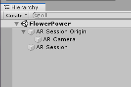

# AR Foundations Demo App

----
## Resources
[AR Foundations Sample Apps by Unity](https://github.com/Unity-Technologies/arfoundation-samples)

These sample scenes are a good place to start to see how to create a AR Foundations scene.

[AR Foundations Documentation -- v2.2](https://docs.unity3d.com/Packages/com.unity.xr.arfoundation@2.2/manual/index.html)

From the Manual, this covers setup and describes the basic features of the package.

## Demo App
The concept for this app is that you can place some seedlings in your environment and then when you 'throw' water at them, they will grow. For the demo, we will cover how to place objects onto a detected plane and also how to spawn a water prefab to interact with these virtual items. However, you could develop the gameplay more in a number of ways -- by adding different varieties of plants with different requirements (how much water, i.e.), introducing different mechanics such as fertilizers or weeding, adding timers to the 'watering can' or the plants, etc. 

----
### Setup

1. Launch Unity and start a new 3D project.
2. In `Window > Package Manager`:
 - select `All Packages` from the dropdown at the top left of the Package Manager and wait for packages to load
 - Locate **ARFoundation** and hit `Install`
 - Install **ARKit XR Plugin**, **ARCore XR Plugin**, or both depending on your target hardware. Note you'll need a Mac + iOS device to build for iOS. You can build for Android from either a Mac or PC.
3. Close the Package Manager, and delete the Camera and Directional Light from the Hierarchy. You should have an empty Scene now.
4. Right-click in the Hierarchy, and select `XR > AR Session` from the context menu.
5. Right-click in the Hierarchy, select `XR > AR Session Origin` from the context menu.

*Your Hierarchy should appear like this after adding the AR Session and AR Session Origin prefabs*

###Build Your App to Your Device

You can now build your empty AR scene and you will see the camera output to the screen. Even if you want to skip the build step, it's a good time to get your Build Settings straightened out.

1. Go to `File > Build Settings`
2. Select either **Android** or **iOS** from the Platform list and hit `Switch Platform` -- you will have to wait for a few minutes for this process.
3. Still in Build Settings, add the current scene to the build by hitting the `Add Open Scenes` button at the bottom right of the Scenes in Build field.
4. Now click the `Player Settings...` button at the bottom left of the Build Settings window. You'll need to change several settings, depending on your platform (iOS or Android)
 
**iOS:**
   
- In `Player Settings > Other Settings > Identification` add an appropriate Bundle Identifier and your Apple Developer Signing information (most likely just your Apple ID).
- In `Player Settings > Other Settings > Configuration` enter `Camera` in the **Camera Usage Description** field.
- Check the `Requires ARKit Support`

**Android:**

 - In `Other Settings > Rendering > Graphics APIs` remove Vulkan from the list by selecting it and clicking the minus button.
 - In `Other Settings > Rendering` **Deselect** the **Multithreaded Rendering** checkbox 
 - In `Other Settings > Identification` add an appropriate Package Name
 - In `Other Settings > Identification` change the `Minimum API Level` to **Android 7.0 'Nougat' (API level 24)**
 - In `Other Settings > Configuration > Target Architectures` make sure **x86** support is **Disabled**

You'll also want to change your Company Name and Product Name at the top of the Player Settings window.

Now, you can try building your app if you'd like. Even though it looks like you're seeing just the 

----

